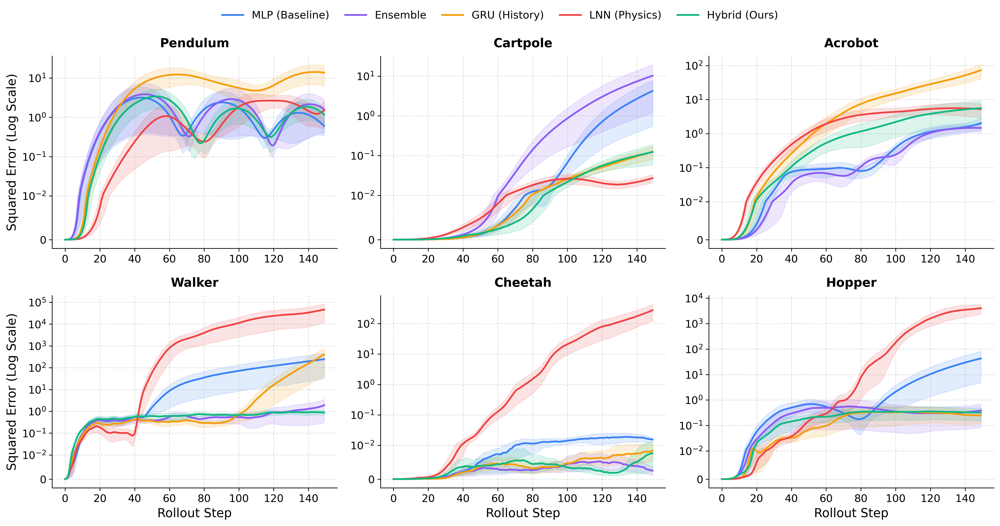
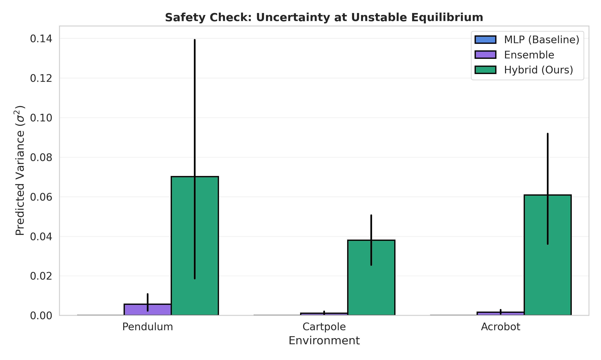

# Physics-Guided Learned Dynamics Models
**Flow Matching • Generative Dynamics • Lagrangian Neural Networks**

Research prototype exploring **hybrid physics–generative dynamics models** for long-horizon prediction and uncertainty estimation in continuous-control systems.

This project compares:

- Black-box learned dynamics (MLP, Ensemble, GRU)
- Physics-informed Lagrangian Neural Networks (LNN)
- Hybrid physics-conditioned generative residual models (Flow Matching)

The central hypothesis is that **structured physical priors + generative residual dynamics** improve rollout stability while producing more conservative uncertainty estimates near unstable equilibria.

---

# 🔬 Overview

Learning accurate dynamics models is difficult due to compounding rollout error and instability over long horizons.

Pure neural models:
- Often learn short-term transitions well
- Drift or diverge during long rollouts

Physics-structured models:
- Provide stability and inductive bias
- May underfit complex residual effects

This project investigates a hybrid approach:
Physics Prior (LNN) → Generative Residual Flow → Final Acceleration


Goals:

- Reduce long-horizon rollout error
- Improve generalization across environments
- Study uncertainty behaviour in unstable regimes

---

# 🧠 Implemented Models

## Black-Box Models
- **MLP Dynamics Model**
- **Deep Ensemble**
- **GRU Sequential Predictor**

## Physics-Structured Model
- **Lagrangian Neural Network (LNN)**
  - Learns mass matrix via Cholesky parameterization
  - Differentiable Lagrangian mechanics formulation

## Hybrid Generative Model (Ours)
- Physics-conditioned flow matching residual
- Residual acceleration sampled via iterative flow integration
- Designed to produce conservative uncertainty estimates

---

# 🌍 Environments

Experiments use the DeepMind Control Suite:

- Pendulum (swingup)
- Cartpole (balance)
- Acrobot (swingup)
- Walker (walk)
- Cheetah (run)
- Hopper (hop)

---
```
# 📁 Repository Structure
.
├── train.py # Training + evaluation pipeline
├── plot_results.py # Visualization + analysis script
├── paper_rollout_results.png
├── paper_bifurcation.png
├── requirements.txt
└── README.md
```

Design note: experiments are intentionally consolidated into a small number of scripts to keep research iterations transparent and reproducible.

---

# ⚙️ Installation

```bash
pip install -r requirements.txt
```

Core dependencies:
- PyTorch
- dm_control
- NumPy / Pandas
- Matplotlib / Seaborn

GPU is recommended but not required.

---

🚀 Running Experiments
1. Train Models + Collect Results

```bash
python train.py
```

This script:

Collects transitions from dm_control environments

Trains all baseline + hybrid models

Evaluates rollout stability

Saves aggregated results to:

```bash
results.pkl
```

2. Analyze results and Generate figures

```bash
python plot_results.py
```

Outputs:
- paper_rollout_results.png
- paper_bifurcation.png

---
📊 Results
Long-Horizon Rollout Error

Hybrid physics-generative models demonstrate improved stability and lower long-horizon error on several tasks.

<p align="center">  </p>

Observations:
- Hybrid model maintains stable error growth on locomotion tasks.
- Pure physics models may diverge when residual dynamics dominate.
- History-based GRU accumulates larger drift over long horizons.

Safety Check: Uncertainty Near Unstable Equilibria
<p align="center">  </p>

Key insight:

Hybrid flow models produce more conservative uncertainty estimates near unstable states compared to ensembles, suggesting potential benefits for safety-critical control settings.

🧪 Method Highlights
- Invariant coordinate preprocessing
- Physics-consistent mass matrix learning
- Flow matching for residual acceleration
- Multi-seed evaluation with SEM confidence intervals
- Symlog rollout error visualization

⚠️ Project Status
- This repository is a research prototype focused on experimental clarity rather than production engineering.
- Code is intentionally minimal and consolidated to simplify reproducibility during rapid research iteration.

👤 Author Notes

This project explores whether hybrid physics-generative models can:
- Improve long-horizon stability
- Capture structured dynamics with learned residuals
- Provide conservative uncertainty estimates near unstable regimes
